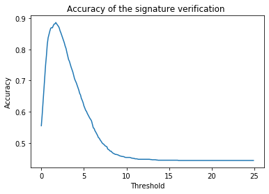

# 4_Signature_Verification
Pattern Recognition - Task 4

## Getting started
Download the files given for this task and put everything in a folder named "groundtruth"

## Feature selection and normalization
After taking the data from the text files to put them in arrays, a dictionairy was created for the validation and enrollement data to fasciliate the extraction of features and to better save them for the next steps in the project.

We extracted the time, x, y, and pressure directly from the data that was given. The velocities in the x and y directions were calculated with time increments of 0.01 seconds. Our formula was to take the previous point and subtract the current point from it before dividing by the time difference of 0.01. 
After troubles understanding the data, we concluded that we din't need the penup feature. The pen position (x, y) is recorded even though the pen is in an up position, and the information of position and velocity will still be used to compare signatures.

After extracting the features for each signature we normalized them. This was done by taking each feature and subtracting the minimum value in the feature array from it and dividing this difference by the difference between the max and min values in the feature array. All normalized values fall in the interval of [0,1]. The time was normalized in the DTW step since we had to manipulate it to get signatures of same time length.

## Results
### Data preparation and features

### DTW
* For each user, a mean dissimilarity between the 5 genuine signatures is computed. It will be used to decide if a signature is valid or not.
* For each user, every verification signature is compared to the 5 genuine signatures. The mean dissimilarity is stored for each verification signature.

### Evaluation
* In order to know if a verification signature is accepted as genuine or fake, we compare the mean dissimilarity of it with the one obtained between the 5 genuine signatures by a subtraction between the two values. If the result of this subtraction is below or equal to a certain threshold then the signature is valid, otherwise it is a fake. The optimal threshold was chosen by evaluating the accuracy of the predictions with the ground-truth.

* The maximal accuracy obtained is 88.59%

* Then the precision and recall curve is the following one with an AP=0.917 :

